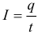
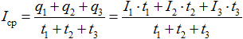

## 10. Электрический ток
### Оглавление:
- Основные теоретические сведения
    - Электрический ток. Сила тока. Сопротивление
    - Закон Ома. Последовательное и параллельное соединение проводников
    - ЭДС. Закон Ома для полной цепи
    - Работа и мощность тока. Закон Джоуля-Ленца
    - Энергобаланс замкнутой цепи
    - Электролиз
    - Электрический ток в газах и в вакууме
## Основные теоретические сведения
### Электрический ток. Сила тока. Сопротивление
В проводниках при определенных условиях может возникнуть непрерывное упорядоченное движение свободных носителей электрического заряда. Такое движение называется электрическим током. За направление электрического тока принято направление движения положительных свободных зарядов, хотя в большинстве случае движутся электроны – отрицательно заряженные частицы.

Количественной мерой электрического тока служит сила тока I – скалярная физическая величина, равная отношению заряда q, переносимого через поперечное сечение проводника за интервал времени t, к этому интервалу времени:
  

Если ток не постоянный, то для нахождения количества прошедшего через проводник заряда рассчитывают площадь фигуры под графиком зависимости силы тока от времени.

Если сила тока и его направление не изменяются со временем, то такой ток называется постоянным. Сила тока измеряется амперметром, который включается в цепь последовательно. В Международной системе единиц СИ сила тока измеряется в амперах [А]. 1 А = 1 Кл/с.

Средняя сила тока находится как отношение всего заряда ко всему времени (т.е. по тому же принципу, что и средняя скорость или любая другая средняя величина в физике):

